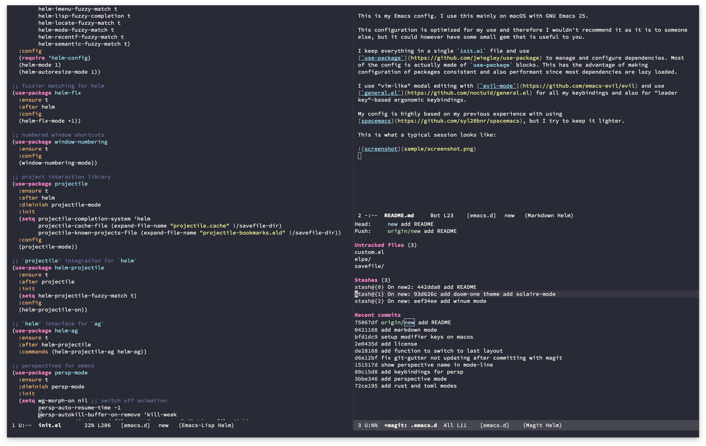

# emacs.d

This is my Emacs config. I use this mainly on macOS with GNU Emacs 25.

This configuration is optimized for my use and therefore I wouldn't recommend it as it is to someone
else, but it could however have some small gem that is useful to you.

I keep everything in a single `init.el` file and use
[`use-package`](https://github.com/jwiegley/use-package) to manage and configure dependencies. Most
of the config is actually made of `use-package` blocks. This has the advantage of making
configuration of packages consistent and also performant since most dependencies are lazy loaded.

I use "vim-like" modal editing with [`evil-mode`](https://github.com/emacs-evil/evil) and use
[`general.el`](https://github.com/noctuid/general.el) for all my keybindings and also for "leader
key"-based ergonomic keybindings.

My config is highly based on my previous experience with using
[spacemacs](https://github.com/syl20bnr/spacemacs), but I try to keep it lighter.

This is what a typical session looks like:

